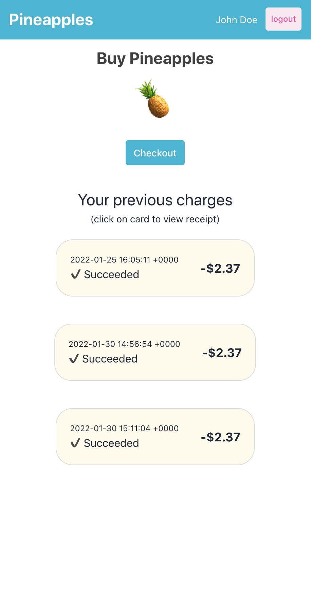

# Buy Pineapples
A simple web/iOS/Android app that lets users signup, 'buy pineapples', and view their previous transactions.

## Setup
1. `yarn install`
2. `yarn start`

## Try it out,
1. Login with Google
2. Click on 'Checkout'
3. Fill out the checkout page
   1. Enter the email that you signed up with. (That way the transaction would get mapped to your account.)
   2. Enter one of the following test card numbers, depending on the case you want to see:
      - Success
        - 4242424242424242
      - Success but with [3DSecure](https://en.wikipedia.org/wiki/3-D_Secure)
        - 4000000000003220
      - Decline
        - 4000000000000002
4. You should now see the transaction showing in the UI after you close the checkout page

## Tools used (and the use behind each):
- [React Native](https://reactnative.dev/)
    - For making the UI
- [Native Base](https://nativebase.io/)
    - Web compatible React Native (iOS/Android) component library
- [Expo](https://expo.dev/)
    - For making and deploying a web/iOS/Android compatible app using React Native
- [Firebase](https://firebase.google.com/)
    - For OAuth, and for storing transactions per user (stored in Firestore)
- [Zapier](https://zapier.com/)
    - For a web-hook that listens for Stripe charges and creates a transaction Firestore document for the associated user if there's any (mapped using email)
- [Stripe](https://stripe.com/)
    - For payment processing
    - A [Stripe Payments page](https://stripe.com/docs/connect/creating-a-payments-page) will be used to not deal with creating a server, or with creating Firebase cloud functions (which require an account upgrade)

## Screenshots

